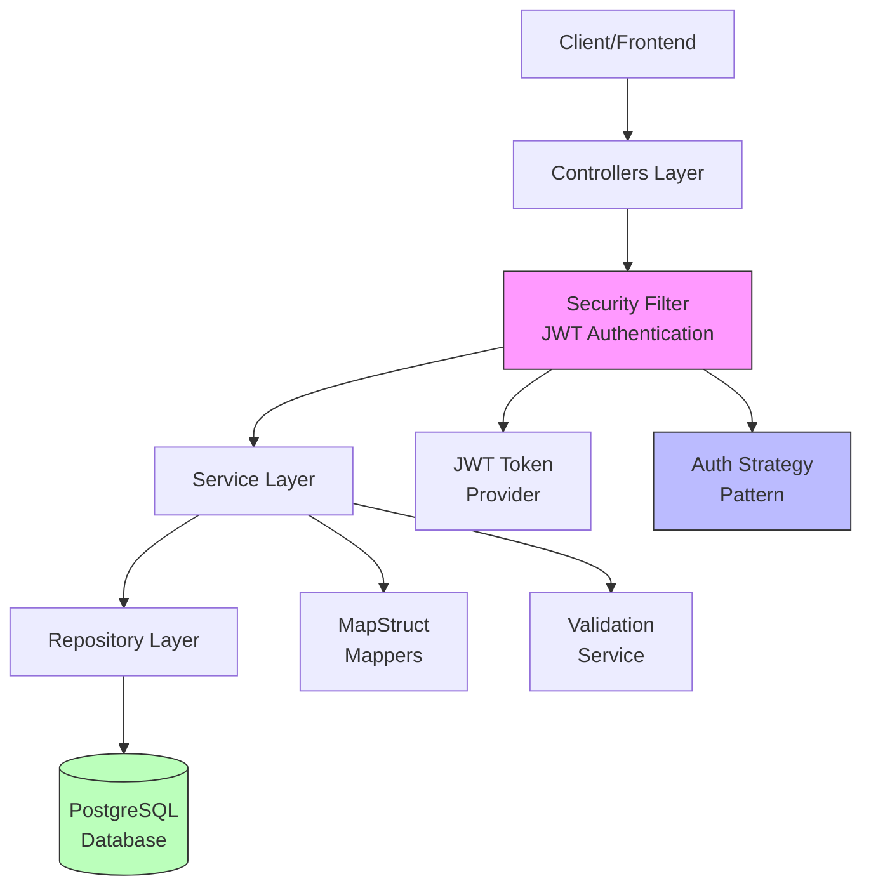
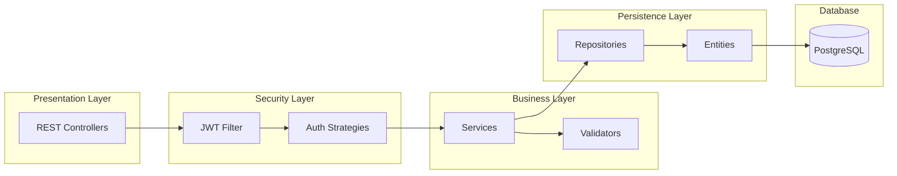

# Yacht Club Argentino - Backend

A comprehensive management system for yacht club operations, built with Spring Boot. This REST API handles member management, boat registration, mooring assignments, and zone administration with role-based access control.

## 🚀 Features

- **Multi-Role Authentication System**
  - Partner (Socio): View personal boats and moorings
  - Employee (Empleado): Read-only access to assigned zones
  - Administrator: Full CRUD operations across all entities

- **Core Functionality**
  - Boat registration and management
  - Mooring assignment and tracking
  - Zone-based organization
  - Employee-to-zone assignments
  - Purchase and assignment date tracking

- **Security**
  - JWT-based authentication
  - BCrypt password hashing
  - Role-based access control (RBAC)
  - Spring Security integration

- **API Documentation**
  - Interactive Swagger UI
  - OpenAPI 3.0 specification

## 🏛️ Architecture

### System Architecture



### Layered Architecture



## 🎯 Design Patterns

### Strategy Pattern (Authentication)
- **Interface**: `UserAuthenticationStrategy`
- **Implementations**: `PartnerAuthStrategy`, `EmployeeAuthStrategy`, `AdminAuthStrategy`
- **Context**: `AuthServiceImpl` iterates through strategies
- **Benefit**: Extensible authentication without modifying existing code

### Repository Pattern
- Spring Data JPA repositories
- Abstraction over data access
- Automatic query generation

### DTO Pattern
- MapStruct for entity-DTO mapping
- Separation of domain and presentation layers
- Prevents over-fetching and exposure of sensitive data

### Dependency Injection
- Constructor injection with Lombok's `@RequiredArgsConstructor`
- Loose coupling between components
- Easier testing and maintenance

## 📡 API Endpoints

### Authentication
| Method | Endpoint | Description | Auth Required |
|--------|----------|-------------|---------------|
| POST | `/api/auth/login` | User authentication | No |

### Partners
| Method | Endpoint | Description | Auth Required |
|--------|----------|-------------|---------------|
| GET | `/api/partners` | List all partners | Yes (ADMIN) |
| GET | `/api/partners/{id}` | Get partner by ID | Yes |
| POST | `/api/partners` | Create new partner | Yes (ADMIN) |
| PUT | `/api/partners/{id}` | Update partner | Yes (ADMIN) |
| DELETE | `/api/partners/{id}` | Delete partner | Yes (ADMIN) |

### Boats
| Method | Endpoint | Description | Auth Required |
|--------|----------|-------------|---------------|
| GET | `/api/boats` | List all boats | Yes |
| GET | `/api/boats/{id}` | Get boat by ID | Yes |
| POST | `/api/boats` | Register new boat | Yes (ADMIN) |
| PUT | `/api/boats/{id}` | Update boat | Yes (ADMIN) |
| DELETE | `/api/boats/{id}` | Delete boat | Yes (ADMIN) |

### Moorings
| Method | Endpoint | Description | Auth Required |
|--------|----------|-------------|---------------|
| GET | `/api/moorings` | List all moorings | Yes |
| GET | `/api/moorings/{id}` | Get mooring by ID | Yes |
| POST | `/api/moorings` | Create mooring | Yes (ADMIN) |
| PUT | `/api/moorings/{id}` | Update mooring | Yes (ADMIN) |
| DELETE | `/api/moorings/{id}` | Delete mooring | Yes (ADMIN) |

### Zones
| Method | Endpoint | Description | Auth Required |
|--------|----------|-------------|---------------|
| GET | `/api/zones` | List all zones | Yes |
| GET | `/api/zones/{id}` | Get zone by ID | Yes |
| POST | `/api/zones` | Create zone | Yes (ADMIN) |
| PUT | `/api/zones/{id}` | Update zone | Yes (ADMIN) |
| DELETE | `/api/zones/{id}` | Delete zone | Yes (ADMIN) |

### Employees
| Method | Endpoint | Description | Auth Required |
|--------|----------|-------------|---------------|
| GET | `/api/employees` | List all employees | Yes (ADMIN) |
| GET | `/api/employees/{id}` | Get employee by ID | Yes |
| POST | `/api/employees` | Create employee | Yes (ADMIN) |
| PUT | `/api/employees/{id}` | Update employee | Yes (ADMIN) |
| DELETE | `/api/employees/{id}` | Delete employee | Yes (ADMIN) |


## 🛠️ Tech Stack

- **Framework**: Spring Boot 3.5.8
- **Language**: Java 21
- **Database**: PostgreSQL 42.7.7
- **ORM**: Spring Data JPA / Hibernate
- **Security**: Spring Security + JWT (jjwt 0.12.3)
- **Mapping**: MapStruct 1.6.3
- **Validation**: Spring Boot Validation
- **Documentation**: SpringDoc OpenAPI 2.8.6
- **Build Tool**: Maven
- **Dev Tools**: Lombok, Spring DevTools

## 📋 Prerequisites

- Java 21 or higher
- Maven 3.6+
- PostgreSQL 12+
- Git

## 🔧 Installation & Setup

### 1. Clone the Repository

```bash
git clone https://github.com/dogabyte/yachtclub-backend.git
cd yachtclub-backend
```

### 2. Configure Database

Create a PostgreSQL database:

```sql
CREATE DATABASE yachtclub_db;
```

Update `src/main/resources/application.properties`:

```properties
spring.datasource.url=jdbc:postgresql://localhost:5432/yachtclub_db
spring.datasource.username=your_username
spring.datasource.password=your_password

# JPA/Hibernate
spring.jpa.hibernate.ddl-auto=update
spring.jpa.show-sql=true
spring.jpa.properties.hibernate.format_sql=true

# JWT Configuration
jwt.secret=your-secret-key-here
jwt.expiration=86400000
```

### 3. Build the Project

```bash
mvn clean install
```

### 4. Run the Application

```bash
mvn spring-boot:run
```

The API will be available at `http://localhost:8080`

## 📚 API Documentation

Once the application is running, access the interactive API documentation:

- **Swagger UI**: http://localhost:8080/swagger-ui.html
- **OpenAPI JSON**: http://localhost:8080/v3/api-docs

## 🏗️ Project Structure

```
src/main/java/com/yachtclub/backend/
├── config/              # Application configuration
├── controllers/         # REST API endpoints
├── dtos/               # Data Transfer Objects
├── entities/           # JPA entities
│   ├── Administrator.java
│   ├── Boat.java
│   ├── Employee.java
│   ├── EmployeeZone.java
│   ├── Mooring.java
│   ├── Partner.java
│   └── Zone.java
├── exceptions/         # Custom exception handlers
├── mappers/           # MapStruct mappers
├── repositories/      # Spring Data JPA repositories
├── security/          # JWT & security configuration
└── services/          # Business logic layer
    ├── base/
    ├── impl/
    ├── interfaces/
    └── validation/
```

## 🗄️ Database Schema

### Key Entities

- **Partner**: Club members who own boats
- **Employee**: Staff members assigned to zones
- **Administrator**: System administrators with full access
- **Boat**: Vessels registered in the club
- **Mooring**: Docking spaces in the marina
- **Zone**: Organizational areas within the marina
- **EmployeeZone**: Many-to-many relationship between employees and zones

### Key Relationships

- Partner → Boats (One-to-Many)
- Boat → Mooring (One-to-One)
- Mooring → Zone (Many-to-One)
- Employee ↔ Zone (Many-to-Many via EmployeeZone)

## 🔐 Authentication

### Login

```bash
POST /api/auth/login
Content-Type: application/json

{
  "username": "admin",
  "password": "password"
}
```

Response:
```json
{
  "token": "eyJhbGciOiJIUzI1NiIsInR5cCI6IkpXVCJ9...",
  "type": "Bearer",
  "role": "ADMIN"
}
```

### Using the Token

Include the JWT token in subsequent requests:

```bash
Authorization: Bearer <your-token-here>
```

## 🧪 Testing

Run the test suite:

```bash
mvn test
```

## 📦 Building for Production

Create a production-ready JAR:

```bash
mvn clean package -DskipTests
```

Run the JAR:

```bash
java -jar target/yachtclub-backend-0.0.1-SNAPSHOT.jar
```

## 🌐 CORS Configuration

CORS is enabled for frontend integration. Update `SecurityConfig.java` to modify allowed origins:

```java
.cors(cors -> cors.configurationSource(request -> {
    CorsConfiguration config = new CorsConfiguration();
    config.setAllowedOrigins(Arrays.asList("http://localhost:4200"));
    // ... additional configuration
}))
```

## 📝 Environment Variables

For production deployment, use environment variables:

```bash
export DB_URL=jdbc:postgresql://your-db-host:5432/yachtclub_db
export DB_USERNAME=your_username
export DB_PASSWORD=your_password
export JWT_SECRET=your-production-secret
export JWT_EXPIRATION=86400000
```

## 🤝 Contributing

1. Fork the repository
2. Create a feature branch (`git checkout -b feature/amazing-feature`)
3. Commit your changes (`git commit -m 'Add amazing feature'`)
4. Push to the branch (`git push origin feature/amazing-feature`)
5. Open a Pull Request

## 📄 License

This project is licensed under the MIT License - see the LICENSE file for details.

## 👥 Authors

- **Gabriel** - *Initial work* - [dogabyte](https://github.com/dogabyte)

## 🙏 Acknowledgments

- Built as a final project for Programming II course
- Spring Boot documentation and community
- MapStruct for simplified object mapping
